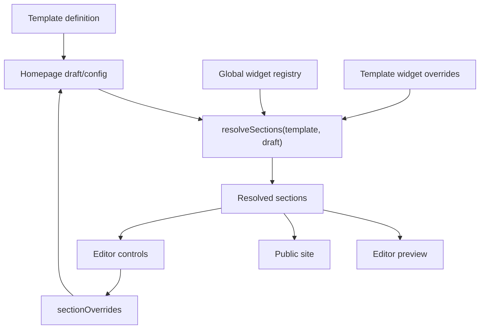

# Template Authoring Guide

This guide explains how to create a website template from scratch for the mosque website editor, how to define sections and groups, and how to create or override widgets with template-specific styling and props.

The current system is intentionally template-aware:

- Templates decide the homepage section structure.
- Global widgets provide reusable defaults.
- A template may override any widget by stable widget ID.
- Editor changes are saved in the existing `sectionOverrides` object.
- Public pages and editor previews use the same resolved template/widget data.

## Core Files

| Purpose | File or folder |
| --- | --- |
| Template definitions | `templates/*.ts` |
| Template registry | `templates/index.ts` |
| Global widget definitions | `widgets/*.ts` |
| Widget definition types | `types/widget.ts` |
| Template and resolved section types | `types/template.ts` |
| Template/widget resolver | `utils/homepage.ts` |
| Global widget Vue components | `app/components/widgets/*.vue` |
| Template-specific widget Vue components | `app/components/templates/<template-id>/widgets/*.vue` |
| Component registration and fallback | `app/components/tenant/widgetComponents.ts` |
| Single section renderer | `app/components/tenant/SectionRenderer.vue` |
| Group section renderer | `app/components/tenant/GroupRenderer.vue` |
| Editor section controls | `app/components/editor/panels/SectionEditor.vue` |
| Editor group controls | `app/components/editor/panels/GroupEditor.vue` |

## Mental Model



The important function is `resolveSections(template, draft)` in `utils/homepage.ts`. It combines:

1. The selected template.
2. The global widget registry.
3. Any template-specific widget overrides.
4. Section/group defaults from the template.
5. Saved user edits from `sectionOverrides`.

The result is a list of `ResolvedSection` objects. Renderers and editor panels should use these resolved objects instead of looking up global widgets directly.

## Step 1: Pick a Template ID

Choose a short stable ID. Use lowercase kebab case.

Good examples:

- `classic`
- `fattan`
- `noor`
- `urban-minaret`

Avoid changing the ID later because saved site configs refer to `templateId`.

Recommended file layout:

```text
templates/urban-minaret.ts
app/components/templates/urban-minaret/widgets/
public/templates/urban-minaret.svg
```

## Step 2: Create the Template File

Create a new file in `templates/<template-id>.ts`.

Minimal example:

```ts
import type { TemplateDefinition } from '~~/types/template'

export const urbanMinaretTemplate: TemplateDefinition = {
  id: 'urban-minaret',
  name: 'Urban Minaret',
  description: 'A bold editorial layout for city mosques.',
  thumbnail: '/templates/urban-minaret.svg',
  defaultPaletteId: 'emerald',
  defaultFontPairId: 'inter-amiri',
  header: {
    component: 'TenantHeader',
    props: { sticky: true, style: 'default' }
  },
  footer: {
    component: 'TenantFooter',
    props: { style: 'default' }
  },
  dataDependencies: [
    'settings',
    'navItems',
    'prayerTimes',
    'jummahTimes',
    'events',
    'announcements',
    'donations'
  ],
  sections: [
    {
      id: 'hero',
      title: 'Hero',
      type: 'single',
      required: true,
      removable: false,
      widgetId: 'hero',
      defaultProps: {
        variant: 'with-buttons',
        eyebrow: 'Welcome',
        title: 'A mosque at the heart of the city.',
        subtitle: 'Prayer, learning, service, and community care.',
        primaryLabel: 'Prayer times',
        primaryUrl: '#prayers',
        secondaryLabel: 'Events',
        secondaryUrl: '#events',
        imageUrl: '/templates/mosque-hero-1.svg',
        align: 'left'
      }
    },
    {
      id: 'prayers',
      title: 'Prayer Times',
      type: 'single',
      required: true,
      removable: false,
      widgetId: 'prayer-times',
      defaultProps: {
        variant: 'cards',
        title: 'Today Prayer Times',
        showIqamah: true,
        showSunrise: true
      }
    }
  ]
}
```

## Step 3: Register the Template

Add the new template to `templates/index.ts`.

```ts
import { urbanMinaretTemplate } from './urban-minaret'

export const templates: TemplateDefinition[] = [
  classicTemplate,
  modernTemplate,
  fattanTemplate,
  noorTemplate,
  urbanMinaretTemplate
]
```

Once registered, the editor can list the template and the resolver can load it by `templateId`.

## Step 4: Add a Thumbnail

Add a thumbnail under `public/templates/`.

The template definition references it with:

```ts
thumbnail: '/templates/urban-minaret.svg'
```

Use a small SVG or image that quickly communicates the template layout. Keep it lightweight because the Theme panel may show multiple template cards.

## Step 5: Understand Section Types

A template section is either:

- `single`: one widget fills the section.
- `group`: multiple widgets are arranged together.

### Single Section

A single section points to one `widgetId`.

```ts
{
  id: 'donate',
  title: 'Donation CTA',
  type: 'single',
  required: false,
  removable: true,
  widgetId: 'donation-cta',
  defaultProps: {
    variant: 'banner',
    title: 'Support your mosque',
    subtitle: 'Help sustain prayers, education, and community care.',
    buttonLabel: 'Donate now'
  }
}
```

Important fields:

| Field | Meaning |
| --- | --- |
| `id` | Stable section ID used in config and overrides. Do not rename casually. |
| `title` | Editor label. |
| `type` | Use `single`. |
| `required` | Required sections cannot be disabled. |
| `removable` | Whether the user may remove/disable it. |
| `widgetId` | Stable global or template-specific widget ID. |
| `defaultProps` | Template-level defaults for this section. |

### Group Section

A group section contains multiple widgets.

```ts
{
  id: 'featured',
  title: "Jumu'ah & Events",
  type: 'group',
  required: false,
  removable: true,
  group: {
    layout: 'row',
    groupProps: [
      {
        key: 'layout',
        label: 'Layout',
        type: 'select',
        default: 'row',
        options: [
          { label: 'Side by side', value: 'row' },
          { label: 'Stacked', value: 'stack' }
        ]
      }
    ],
    widgets: [
      {
        slot: 'main',
        widgetId: 'events',
        defaultProps: {
          variant: 'list',
          title: 'Upcoming Events',
          maxItems: 3
        }
      },
      {
        slot: 'side',
        widgetId: 'jummah-times',
        defaultProps: {
          title: "Jumu'ah Prayers",
          showLocation: true
        }
      }
    ]
  }
}
```

Important group fields:

| Field | Meaning |
| --- | --- |
| `group.layout` | Default render layout, currently commonly `row` or `stack`. |
| `group.groupProps` | Editable props for the group container itself. |
| `group.widgets` | Widget slots inside the group. |
| `slot` | Stable slot key used for saved widget overrides inside a group. |
| `defaultProps` | Defaults for that widget in that slot. |

Do not reuse the same `slot` inside one group. Saved overrides are keyed by slot.

## Step 6: Use Existing Global Widgets

Most templates should start with global widgets before creating custom ones.

Current global widget IDs include:

```text
hero
carousel
prayer-times
prayer-countdown
jummah-times
announcements
events
donation-cta
about-mosque
services
gallery
contact
location-map
text
rich-text
image
quick-links
```

Each global widget has:

- A definition in `widgets/<widget-id>.ts`.
- A component in `app/components/widgets/Widget<Name>.vue`.
- A registration entry in `app/components/tenant/widgetComponents.ts`.

Example global definition:

```ts
export const prayerTimesWidget: WidgetDefinition = {
  id: 'prayer-times',
  name: 'Prayer Times',
  icon: 'i-lucide-clock-3',
  description: 'Daily salah timetable with optional iqamah times.',
  category: 'data',
  variants: [
    { id: 'table', name: 'Table' },
    { id: 'cards', name: 'Cards' },
    { id: 'compact', name: 'Compact' }
  ],
  component: 'WidgetPrayerTimes',
  dataDependencies: ['prayerTimes'],
  propSchema: [
    {
      key: 'variant',
      label: 'Style',
      type: 'select',
      default: 'cards',
      options: [
        { label: 'Table', value: 'table' },
        { label: 'Cards', value: 'cards' },
        { label: 'Compact', value: 'compact' }
      ]
    },
    { key: 'title', label: 'Title', type: 'text', default: 'Today Prayer Times' },
    { key: 'showIqamah', label: 'Show iqamah', type: 'toggle', default: true },
    { key: 'showSunrise', label: 'Show sunrise', type: 'toggle', default: true }
  ]
}
```

## Step 7: Understand Prop Schemas

Widget props shown in the editor come from `propSchema`.

Supported prop types are defined in `types/widget.ts`:

```ts
export type WidgetPropType =
  | 'text'
  | 'textarea'
  | 'richtext'
  | 'number'
  | 'toggle'
  | 'select'
  | 'color'
  | 'image'
  | 'url'
  | 'icon'
```

Prop schema shape:

```ts
{
  key: 'title',
  label: 'Title',
  type: 'text',
  default: 'Today Prayer Times',
  required: true,
  placeholder: 'Enter a section title'
}
```

Select example:

```ts
{
  key: 'variant',
  label: 'Style',
  type: 'select',
  default: 'cards',
  options: [
    { label: 'Cards', value: 'cards' },
    { label: 'Compact', value: 'compact' }
  ]
}
```

Conditional field example:

```ts
{
  key: 'buttonUrl',
  label: 'Button URL',
  type: 'url',
  default: '#',
  showWhen: { key: 'showButton', value: true }
}
```

The editor reads these schemas automatically. If a prop appears in the resolved schema, it appears in the section or group widget editor.

## Step 8: Know the Prop Merge Order

For a single section, final props are resolved in this order:

1. Global widget schema defaults.
2. Template widget override schema defaults.
3. Section `defaultProps`.
4. Saved editor overrides from `sectionOverrides[sectionId].props`.

Later values win.

For a widget inside a group, final props are resolved in this order:

1. Global widget schema defaults.
2. Template widget override schema defaults.
3. Group widget slot `defaultProps`.
4. Saved editor overrides from `sectionOverrides[sectionId].widgets[slot].props`.

For group container props, final props are resolved in this order:

1. `group.groupProps` defaults.
2. Saved editor overrides from `sectionOverrides[sectionId].groupProps`.

This means:

- Global widget definitions should provide sensible generic defaults.
- Template widget overrides should provide template-wide defaults.
- Section/group `defaultProps` should tune a widget for that exact placement.
- Editor changes always win last.

## Step 9: Override an Existing Widget

Use a template widget override when a template should use the same stable widget ID but render it with different styling, component logic, variants, or extra props.

Example from the Fattan template:

```ts
widgets: {
  'prayer-times': {
    name: 'Fattan Prayer Times',
    description: 'Plum and gold feature panel with highlighted next prayer.',
    component: 'FattanPrayerTimes',
    variants: [
      { id: 'feature-panel', name: 'Feature panel' }
    ],
    propSchema: [
      {
        key: 'variant',
        label: 'Style',
        type: 'select',
        default: 'feature-panel',
        options: [
          { label: 'Feature panel', value: 'feature-panel' }
        ]
      },
      {
        key: 'hijriDate',
        label: 'Hijri date',
        type: 'text',
        default: '16 Dhul Qaadah 1447'
      },
      {
        key: 'backgroundImageUrl',
        label: 'Background image',
        type: 'image',
        default: '/templates/mosque-hero-3.svg'
      }
    ]
  }
}
```

What this does:

- Keeps the saved/base widget ID as `prayer-times`.
- Replaces the component with `FattanPrayerTimes`.
- Replaces the `variant` prop schema because it uses the same key.
- Adds `hijriDate` and `backgroundImageUrl` because they are new keys.
- Keeps default global props such as `title`, `showIqamah`, and `showSunrise` unless explicitly replaced.

Template prop schemas merge by `key`:

- Same key: template field replaces global field.
- New key: template field is appended.

## Step 10: Create the Override Vue Component

Template-specific components live under:

```text
app/components/templates/<template-id>/widgets/
```

Example:

```text
app/components/templates/fattan/widgets/FattanPrayerTimes.vue
```

Basic component shape:

```vue
<script setup lang="ts">
import type { PrayerTimeEntry } from '~~/utils/widget-content'

const props = withDefaults(defineProps<{
  title?: string
  variant?: string
  showIqamah?: boolean
  showSunrise?: boolean
  hijriDate?: string
  backgroundImageUrl?: string
  data?: PrayerTimeEntry[]
}>(), {
  title: 'Prayer Times',
  variant: 'feature-panel',
  showIqamah: true,
  showSunrise: false,
  hijriDate: '',
  backgroundImageUrl: ''
})
</script>

<template>
  <section class="template-prayer-times">
    <h2>{{ props.title }}</h2>
    <!-- Render the template-specific design here. -->
  </section>
</template>
```

Widget components receive:

- Resolved editor/template props as normal Vue props.
- Data props when the renderer passes widget data, such as prayer times, events, announcements, or donations.

Keep template-specific class names scoped to the template when possible, for example:

```css
.fattan-prayer-card {}
.urban-minaret-prayer-card {}
```

This prevents one template style from accidentally changing another template.

## Step 11: Register the Component

Add the component to `app/components/tenant/widgetComponents.ts`.

```ts
import UrbanMinaretPrayerTimes from '~/components/templates/urban-minaret/widgets/UrbanMinaretPrayerTimes.vue'

const namedWidgetComponents: Record<string, Component> = {
  // Keep the existing entries and append the new template component.
  WidgetHero,
  WidgetPrayerTimes,
  FattanPrayerTimes,
  UrbanMinaretPrayerTimes
}
```

Then reference the same component key in the template override:

```ts
widgets: {
  'prayer-times': {
    component: 'UrbanMinaretPrayerTimes'
  }
}
```

The resolver has fallback behavior:

- If `component` exists in `namedWidgetComponents`, it renders that component.
- If the named component is missing but the base `widgetId` exists globally, it falls back to the global component.
- If neither exists, it renders nothing and logs a dev-only warning.

## Step 12: Add Template Defaults for the Override

After adding a widget override, set defaults in the template section or group slot.

Single section:

```ts
{
  id: 'prayers',
  title: 'Prayer Times',
  type: 'single',
  required: true,
  removable: false,
  widgetId: 'prayer-times',
  defaultProps: {
    variant: 'feature-panel',
    title: 'Prayer Times',
    showIqamah: true,
    showSunrise: false,
    hijriDate: '16 Dhul Qaadah 1447',
    backgroundImageUrl: '/templates/mosque-hero-3.svg'
  }
}
```

Group widget slot:

```ts
{
  slot: 'main',
  widgetId: 'prayer-times',
  defaultProps: {
    variant: 'feature-panel',
    title: 'Today at the mosque',
    hijriDate: '16 Dhul Qaadah 1447'
  }
}
```

The same override applies anywhere that template uses `widgetId: 'prayer-times'`, including inside groups.

## Step 13: Override Props Without Replacing the Component

Sometimes a template should keep the global component but expose different editor choices.

Example:

```ts
widgets: {
  'events': {
    name: 'Programme Cards',
    variants: [
      { id: 'cards', name: 'Cards' },
      { id: 'list', name: 'List' }
    ],
    propSchema: [
      {
        key: 'variant',
        label: 'Style',
        type: 'select',
        default: 'cards',
        options: [
          { label: 'Cards', value: 'cards' },
          { label: 'List', value: 'list' }
        ]
      },
      {
        key: 'accentLabel',
        label: 'Accent label',
        type: 'text',
        default: 'Programmes'
      }
    ]
  }
}
```

Because no `component` is provided, the global `WidgetEvents` component remains in use. Only metadata and props change.

Only add props that the component actually reads. If you add `accentLabel` to the schema but the component never uses it, the editor will save it but the site will not visually change.

## Step 14: Create a Template-Only Widget

Most custom work should override existing widget IDs. Use a template-only widget only when the concept does not map to any global widget.

Example:

```ts
widgets: {
  'urban-sermon-strip': {
    name: 'Sermon Strip',
    icon: 'i-lucide-mic-2',
    description: 'A template-only sermon highlight strip.',
    category: 'content',
    component: 'UrbanSermonStrip',
    propSchema: [
      { key: 'title', label: 'Title', type: 'text', default: 'Latest khutbah' },
      { key: 'speaker', label: 'Speaker', type: 'text', default: 'Imam' },
      { key: 'audioUrl', label: 'Audio URL', type: 'url', default: '' }
    ]
  }
},
sections: [
  {
    id: 'latest-khutbah',
    title: 'Latest Khutbah',
    type: 'single',
    required: false,
    removable: true,
    widgetId: 'urban-sermon-strip',
    defaultProps: {
      title: 'This week at Jumuah'
    }
  }
]
```

Then create and register:

```text
app/components/templates/urban-minaret/widgets/UrbanSermonStrip.vue
```

```ts
import UrbanSermonStrip from '~/components/templates/urban-minaret/widgets/UrbanSermonStrip.vue'

const namedWidgetComponents: Record<string, Component> = {
  // Keep the existing entries and append the new template component.
  WidgetHero,
  WidgetPrayerTimes,
  FattanPrayerTimes,
  UrbanSermonStrip
}
```

Template-only widgets do not appear in the global `/api/widgets` registry. They are available only through templates that define them.

## Step 15: Extend Group Props

Group props control the group container, not the individual widgets.

Example:

```ts
groupProps: [
  {
    key: 'layout',
    label: 'Layout',
    type: 'select',
    default: 'row',
    options: [
      { label: 'Side by side', value: 'row' },
      { label: 'Stacked', value: 'stack' }
    ]
  },
  {
    key: 'tone',
    label: 'Tone',
    type: 'select',
    default: 'soft',
    options: [
      { label: 'Soft', value: 'soft' },
      { label: 'Contrast', value: 'contrast' }
    ]
  }
]
```

The group renderer receives resolved group props in `section.resolvedGroupProps`.

Use group props for layout and container-level presentation:

- `layout`
- `tone`
- `background`
- `spacing`
- `alignment`

Use widget props for content and widget-level presentation:

- `title`
- `subtitle`
- `variant`
- `maxItems`
- `imageUrl`
- `buttonLabel`

## Step 16: Extend Widget Props Inside Groups

Widget overrides apply the same way in groups as they do in single sections.

Example:

```ts
widgets: {
  'jummah-times': {
    name: 'Fattan Jumuah Times',
    propSchema: [
      {
        key: 'cardTone',
        label: 'Card tone',
        type: 'select',
        default: 'plum',
        options: [
          { label: 'Plum', value: 'plum' },
          { label: 'Gold', value: 'gold' }
        ]
      }
    ]
  }
},
sections: [
  {
    id: 'featured',
    title: "Jumu'ah & Events",
    type: 'group',
    required: false,
    removable: true,
    group: {
      layout: 'row',
      widgets: [
        {
          slot: 'side',
          widgetId: 'jummah-times',
          defaultProps: {
            title: "Jumu'ah Prayers",
            cardTone: 'gold'
          }
        }
      ]
    }
  }
]
```

The Group editor will show the resolved widget name, icon, and prop schema from the template override.

## Step 17: Add Data Dependencies

Use `dataDependencies` to declare the data a template or widget needs.

Template example:

```ts
dataDependencies: [
  'settings',
  'navItems',
  'prayerTimes',
  'jummahTimes',
  'events',
  'announcements',
  'donations'
]
```

Widget example:

```ts
dataDependencies: ['prayerTimes']
```

If a template-specific override needs different data from the global widget, override `dataDependencies` in the template widget definition.

```ts
widgets: {
  'events': {
    dataDependencies: ['events', 'announcements']
  }
}
```

Only request what the rendered template actually needs.

## Step 18: Responsive Design Requirements

Every template and template-specific widget must be checked on:

- Desktop.
- Tablet.
- Mobile.

Minimum expectations:

- No horizontal page overflow.
- No clipped text.
- Header navigation works on mobile.
- Cards and grids collapse cleanly.
- Buttons remain tappable.
- Editor preview scrolls.
- Public site and editor preview match.
- Console has no relevant errors or warnings.

Recommended responsive CSS patterns:

```vue
<template>
  <section class="grid gap-4 md:grid-cols-2 xl:grid-cols-4">
    <!-- Cards -->
  </section>
</template>
```

```vue
<template>
  <section class="mx-auto w-full max-w-6xl px-4 sm:px-6 lg:px-8">
    <!-- Content -->
  </section>
</template>
```

Avoid fixed widths that exceed mobile screens. Prefer:

- `w-full`
- `max-w-*`
- `minmax(0, 1fr)`
- responsive grid columns
- `break-words`
- `overflow-hidden` only when intentional

## Step 19: Test the Template

Run typecheck:

```bash
/Users/nasimhayath/.cache/codex-runtimes/codex-primary-runtime/dependencies/node/bin/node node_modules/.bin/nuxi typecheck
```

Run build:

```bash
/Users/nasimhayath/.cache/codex-runtimes/codex-primary-runtime/dependencies/node/bin/node node_modules/.bin/nuxt build
```

Start the built preview server:

```bash
env DATABASE_URL=file:/Users/nasimhayath/Apps/msaas-ai/editor-codex/prisma/dev.db /Users/nasimhayath/.cache/codex-runtimes/codex-primary-runtime/dependencies/node/bin/node .output/server/index.mjs
```

Then test with Chrome DevTools MCP/in-app Browser:

1. Open `/editor/al-noor`.
2. Switch to the new template in the Theme tab.
3. Confirm the template renders in desktop preview.
4. Open the Sections tab.
5. Select each section and confirm expected props appear.
6. Edit template-specific props and confirm the preview updates live.
7. Save and reload.
8. Open `/site/al-noor`.
9. Check desktop, tablet, and mobile viewports.
10. Confirm there is no horizontal overflow.
11. Confirm there are no relevant console errors or warnings.
12. Capture screenshots for desktop, tablet, and mobile.

## Step 20: Common Mistakes

### Component Name Does Not Match Registration

Template override:

```ts
component: 'UrbanPrayerTimes'
```

Registration must include the same key:

```ts
const namedWidgetComponents: Record<string, Component> = {
  // Keep the existing entries and append the new template component.
  WidgetHero,
  WidgetPrayerTimes,
  FattanPrayerTimes,
  UrbanPrayerTimes
}
```

If the names do not match, the renderer falls back to the global widget when possible.

### Added Prop Does Not Change UI

If a new prop appears in the editor but does not affect the site, check that the Vue component actually declares and uses it.

```ts
const props = defineProps<{
  accentLabel?: string
}>()
```

```vue
<p>{{ props.accentLabel }}</p>
```

### Section ID Was Renamed

Changing a section `id` breaks the link to saved section order, enabled state, and overrides. Add new sections carefully and avoid renaming existing IDs after a template is in use.

### Group Slot Was Renamed

Changing a group widget `slot` breaks saved overrides for that widget inside the group.

### Override Replaces a Prop Unexpectedly

Prop schemas merge by `key`. If a template override defines `key: 'variant'`, it replaces the global `variant` field.

This is useful when intentional, but surprising when accidental.

### Template-Specific Props Used Outside the Template

Extra props from a template override only exist when that template is active. Do not expect `hijriDate` from the Fattan prayer widget to appear in Classic unless Classic also defines that override.

## Recommended Template Checklist

Before considering a template complete:

- Template file exists in `templates/<template-id>.ts`.
- Template is registered in `templates/index.ts`.
- Thumbnail exists under `public/templates/`.
- Required sections render without saved overrides.
- Optional sections can be disabled.
- Groups have unique slot names.
- Widget overrides use stable widget IDs.
- Template-specific components are registered in `widgetComponents.ts`.
- Template-specific props appear in the editor.
- Template-specific props update the live preview.
- Public site uses the same widget overrides as the editor.
- Mobile, tablet, and desktop have no horizontal overflow.
- `nuxi typecheck` passes.
- `nuxt build` passes.
- Browser QA screenshots are captured.

## Example: Full Template With Widget Override and Group

```ts
import type { TemplateDefinition } from '~~/types/template'

export const urbanMinaretTemplate: TemplateDefinition = {
  id: 'urban-minaret',
  name: 'Urban Minaret',
  description: 'A bold editorial layout for city mosques.',
  thumbnail: '/templates/urban-minaret.svg',
  defaultPaletteId: 'emerald',
  defaultFontPairId: 'inter-amiri',
  widgets: {
    'prayer-times': {
      name: 'Urban Prayer Times',
      description: 'A high-contrast prayer panel for the Urban Minaret template.',
      component: 'UrbanPrayerTimes',
      variants: [
        { id: 'feature-panel', name: 'Feature panel' }
      ],
      propSchema: [
        {
          key: 'variant',
          label: 'Style',
          type: 'select',
          default: 'feature-panel',
          options: [
            { label: 'Feature panel', value: 'feature-panel' }
          ]
        },
        {
          key: 'eyebrow',
          label: 'Eyebrow',
          type: 'text',
          default: 'Daily prayers'
        },
        {
          key: 'backgroundImageUrl',
          label: 'Background image',
          type: 'image',
          default: '/templates/mosque-hero-1.svg'
        }
      ]
    }
  },
  header: {
    component: 'TenantHeader',
    props: { sticky: true, style: 'default' }
  },
  footer: {
    component: 'TenantFooter',
    props: { style: 'default' }
  },
  dataDependencies: [
    'settings',
    'navItems',
    'prayerTimes',
    'jummahTimes',
    'events',
    'announcements',
    'donations'
  ],
  sections: [
    {
      id: 'hero',
      title: 'Hero',
      type: 'single',
      required: true,
      removable: false,
      widgetId: 'hero',
      defaultProps: {
        variant: 'with-buttons',
        eyebrow: 'Welcome',
        title: 'Faith, learning, and service in the city.',
        subtitle: 'Join daily prayers, circles, youth programmes, and community care.',
        primaryLabel: 'Prayer times',
        primaryUrl: '#prayers',
        secondaryLabel: 'Events',
        secondaryUrl: '#events',
        imageUrl: '/templates/mosque-hero-1.svg',
        align: 'left'
      }
    },
    {
      id: 'prayers',
      title: 'Prayer Times',
      type: 'single',
      required: true,
      removable: false,
      widgetId: 'prayer-times',
      defaultProps: {
        variant: 'feature-panel',
        title: 'Prayer Times',
        eyebrow: 'Daily prayers',
        showIqamah: true,
        showSunrise: false,
        backgroundImageUrl: '/templates/mosque-hero-1.svg'
      }
    },
    {
      id: 'community',
      title: 'Community',
      type: 'group',
      required: false,
      removable: true,
      group: {
        layout: 'row',
        groupProps: [
          {
            key: 'layout',
            label: 'Layout',
            type: 'select',
            default: 'row',
            options: [
              { label: 'Side by side', value: 'row' },
              { label: 'Stacked', value: 'stack' }
            ]
          }
        ],
        widgets: [
          {
            slot: 'events',
            widgetId: 'events',
            defaultProps: {
              variant: 'cards',
              title: 'Upcoming programmes',
              maxItems: 3
            }
          },
          {
            slot: 'notices',
            widgetId: 'announcements',
            defaultProps: {
              variant: 'list',
              title: 'Notices',
              maxItems: 3
            }
          }
        ]
      }
    }
  ]
}
```
